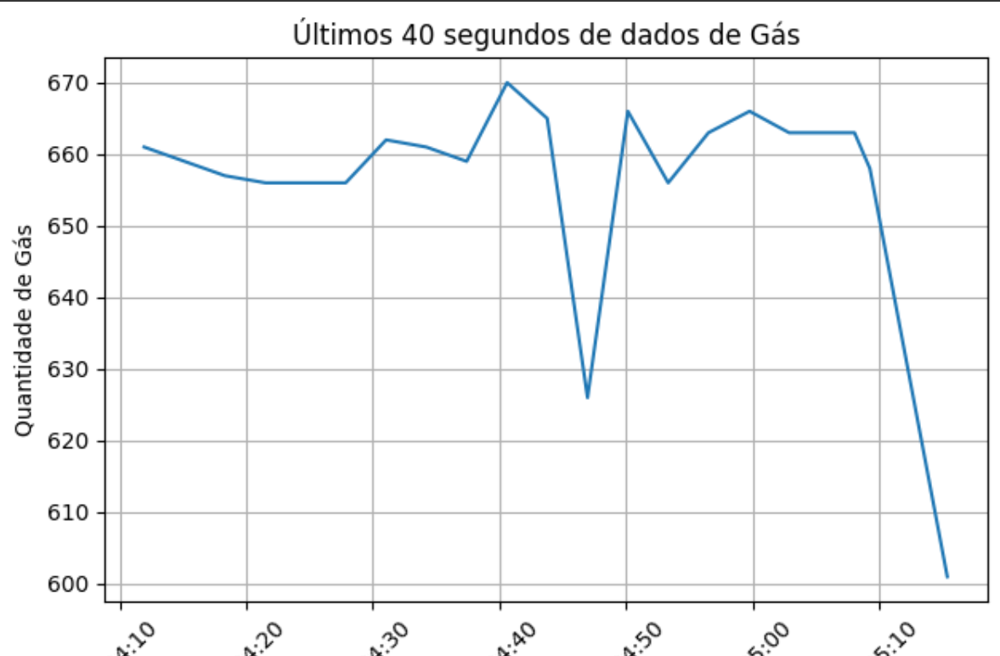
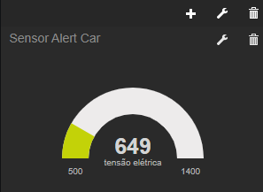
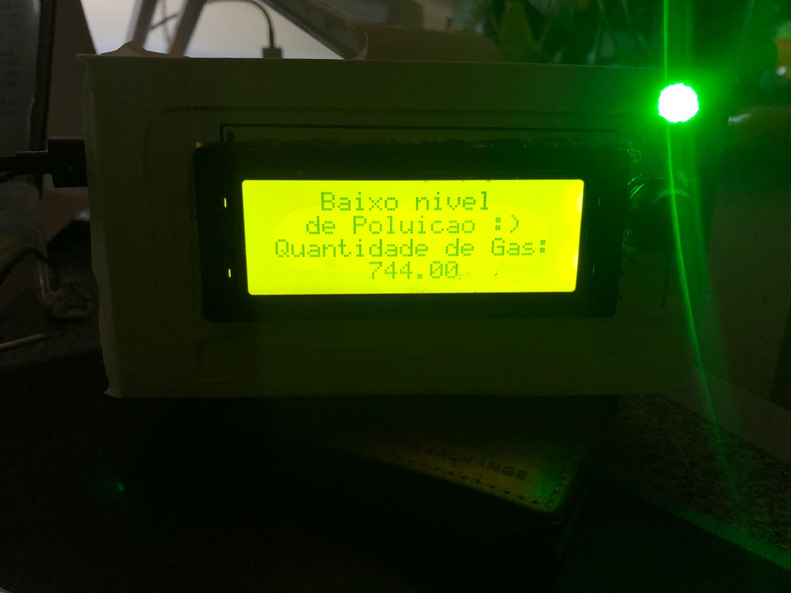
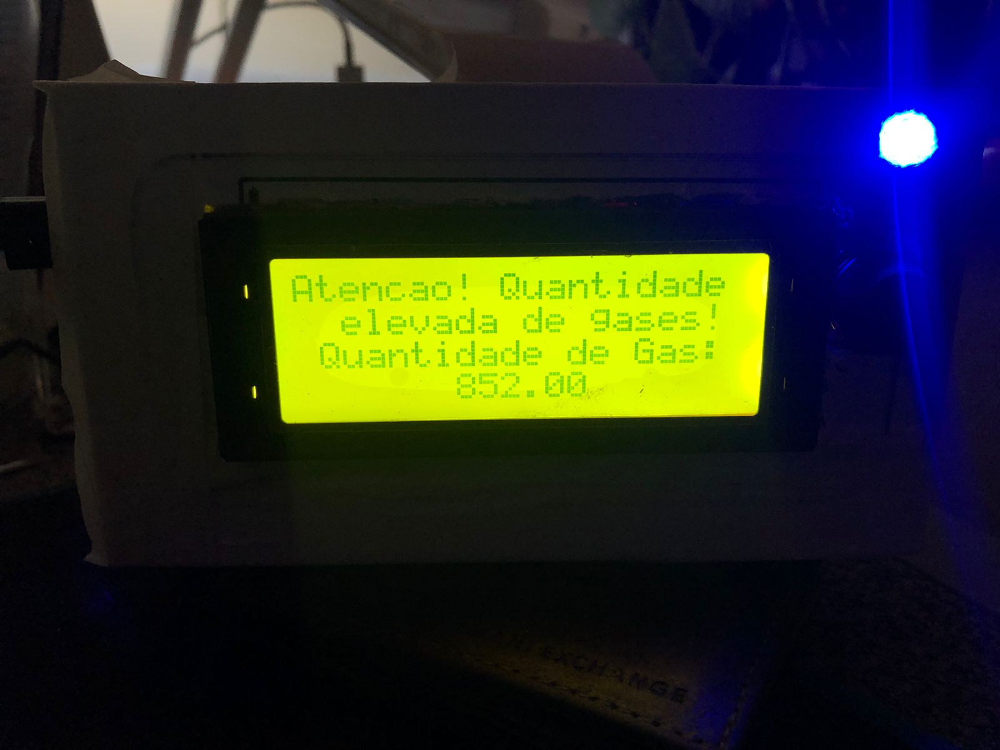
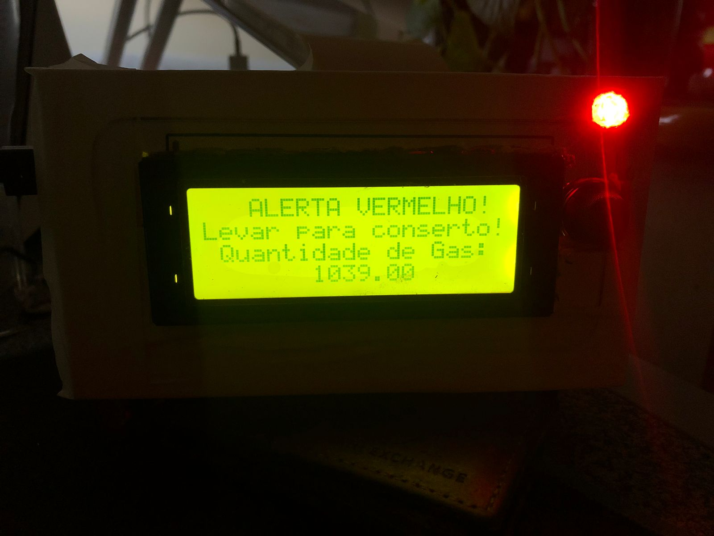

# SensorAlertCar

    Diminuindo a poluição, um carro de cada vez

## Detalhes do projeto:
O dispositivo físico do projeto foi batizado como SensorAlertCar, a instalação do sensor será feita nas proximidades do escapamento do carro, possuindo como funcionalidade a coleta de dados referêntes á poluição gerada por um determinado veículo e retornando aos usuários da aplicação do produto. Os usuários conseguirão vizualizar informações sobre o nível de poluição atual do seu veículo através de dashboards e gráficos.

Os dados coletados pelo sensor serão enviados através do fiware para a aplicação e, de acordo com padrões pré estabelecidos pelas fabricantes de carro sobre a quantidade de poluentes expelidos, o sensor retornará a resposta informando se o carro está poluindo mais do que o esperado ou se está de acordo com os padrões considerados.

## Objetivo do projeto:

O principal objetivo do SensorAlertCar é diminuir a poluição atmosférica e aumentar a qualidade e expectativa de vida das pessoas através do uso da tecnologia.

Para atingir nosso objetivo criamos um aplicativo com detalhes logo abaixo.

### Sobre nossa Aplicação:

A aplicação terá duas opções de login, por um funcionário da empresa ou um cliente que adquiriu o produto com o sensor instalado. Em ambos os logins será possível verificar o status de um determinado veículo, desde que o usuário e seu carro estejam previamente cadastrados pelo funcionário. O objetivo da aplicação é de incentivar os clientes a manterem seus carros em ordem em relação a poluição emitida. Conforme o cliente mantiver seu veículo funcionando corretamente, será gerado créditos no aplicativo, que, através da acumulação desses créditos, o usuário poderá trocá-los por produtos e serviços posteriormente. Mostrando também no final de um período, o quanto a ação preventiva do usuário ajudou a diminuir os poluentes atmosféricos.

## Arquitetura da Solução:

O draft da nossa proposta terá a seguinte estrutura:

Os componentes principais do SensorAlertCar será uma placa com conexão com a internet (esp32) e um mq135 de dióxido de carbono. Se comunicará utilizando o FIWARE (back-end). O dispositivo se comunicará com o mqtt broker através do protocolo MQTT e, à partir do componente IoT Agent mqtt, utilizará o protocolo HTTP para fazer a conexão com o Orion Context Broker (armazenamento de dados em tempo de execução) e o STH-Comet (armazenamento histórico de dados), ambos enviando informações ao banco de dados MongoDB, trazendo os dados para a aplicação (front-end).

#### 1. Dispositivo de Coleta de Dados (ESP32):

O ESP32 será equipado com um sensor mq135 para medir a quantidade de dióxido de carbono, LCD para vizualização de dados, um buzzer para alertar o cliente caso o volume de gás emitido pelo escapamento for maior do que o esperado e um led RGB que altera sua cor sendo, verde para indicar que o nível está ok, azul para indicar que está em nível médio e vermelho que indica que há um excesso de gases poluentes sendo detectado. O esp32 se conectará a uma rede Wi-Fi para se comunicar com o sistema de back-end (FIWARE Descomplicado) urilizando o protocólo de comunicação MQTT.

#### 2. Sistema de Back-end (Fiware Descomplicado):

O sistema de back-end receberá os dados MQTT do ESP32.
Fiware Descomplicado será usado para processar e armazenar esses dados.
Configurar subsistemas Fiware (Orion Context Broker e STH-Comet) para gerenciar entidades de dados, armazenamento e notificações.
Implementar regras de negócios para processar dados, como alertas com base em valores limites de gás detectado pelo sensor mq135, etc.
Armazenar dados históricos em um banco de dados (por exemplo, MongoDB) para análises posteriores.

#### 3. Camada de Front-End:

A camada de front-end será responsável pela visualização dos dados coletados.
Podendo ser um dashboard ou um aplicativo móvel para que os usuários vejam os dados coletados pelo nosso sensor á respeito do seu veículo em tempo real.
APIs disponibilizadas pelo sistema de back-end serão utilizadas para buscar dados e atualizar a interface do usuário.
Será implementado gráficos e visualizações para representar os dados de maneira compreensível pelo usuário.

Observação: Verificamos que o valor obtido pelo sensor de gás mq135 é relativo á tensão elétrica, que é diretamente proporcional a quantidade de gás detectada.

#### 4. Segurança:

Serão implementadas medidas de segurança, como autenticação e autorização, em todas as camadas da solução para proteger os dados sensíveis.

#### 5. Escalabilidade e Manutenção:

A solução será projetada de forma escalável para lidar com um possível aumento no número de dispositivos ou volume de dados.
Práticas de monitoramento para acompanhar o desempenho da solução e identificar problemas rapidamente.

## Montagem do protótipo:

Para a utilização correta e funcional do nosso produto é necessário:

- Obter uma placa ESP32;
- Sensor mq135;
- Led RGB;
- Cabos Jumpers;
- Buzzer;
- LCD 20x4;
- Código funcional do projeto (dentro da pasta "códigos_fonte") executado na placa;
- Conexão com a internet;
- Fonte de alimentação via cabo usb;
- Acesso ao dashboard de vizualização dos dados (freeboard.io).

### Algumas fotos do protótipo funcionando:

## Instruções de Uso:

Para utilizar o produto:

1. Fazer a instalação do SensorAlertCar no seu veículo;
2. Instalar a aplicação;
3. Ter seu token gerado através do cadastro para efetuar seu login;
4. Verificar informações coletadas pelo sensor através de um dashboard e gráficos.

## Integrantes:
- João Lucas (rm: 551612)
- Miguel Ruan (rm: 551239)
- Murilo Marsola Eloys (rm: 552117)
- Ricardo Ramos Vergani (rm: 550166)
- Victor Kenzo Toma (rm: 551649)

