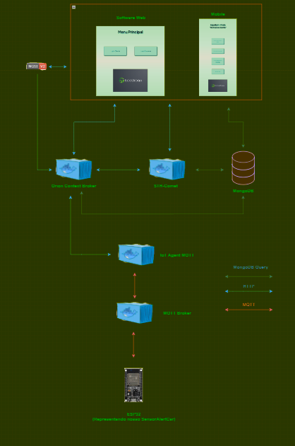

# Edge Computing & Computer Systems
# Challenge IBM - Sprint 3

### Desenvolvimento da arquitetura inicial de uma aplicação IoT capaz de receber e transmitir dados provenientes de dispositivos conectados.

## Integrantes:
- João Lucas (rm: 551612)
- Miguel Ruan (rm: 551239)
- Murilo Marsola Eloys (rm: 552117)
- Ricardo Ramos Vergani (rm: 550166)
- Victor Kenzo Toma (rm: 551649)

## Detalhes do projeto:
O dispositivo físico do projeto foi batizado como SensorAlertCar, o intuito é fazer a instalação do sensor nas proximidades do escapamento do carro, possuindo como funcionalidade a coleta de dados referêntes á poluição gerada por um determinado veículo e retornando aos usuários da aplicação do produto. Os usuários conseguiram vizualizar informações sobre o nível de poluição atual do seu veículo através de dashboards e gráficos.

Os dados coletados pelo sensor serão enviados através do fiware para a aplicação e, de acordo com padrões pré estabelecidos pelas fabricantes de carro sobre a quantidade de poluentes expelidos, o sensor retornará a resposta informando se o carro está poluindo mais do que o esperado ou se está de acordo com os padrões considerados.

### Sobre nossa Aplicação:

A aplicação terá duas opções de login, por um funcionário da empresa ou um cliente que adquiriu o produto com o sensor instalado. Em ambos os logins será possível verificar o status de um determinado veículo, desde que esteja previamente cadastrado pelo funcionário. O intuito da aplicação é de incentivar os clientes a manterem seus carros saudáveis em relação aos dados enviados pelo SensorAlertCar, através de um esquema de acumulação de créditos que poderão ser trocados por produtos e serviços posteriormente. Mostrando também no final de um período, o quanto a ação preventiva do usuário ajudou a amenizar e diminuir os poluentes atmosféricos.

## Arquitetura:

O draft da nossa proposta terá a seguinte estrutura:

Os componentes básicos do SensorAlertCar será uma placa de prototipagem com conexão com a internet (esp32) e um mq135 de dióxido de carbono. Se comunicará utilizando o FIWARE (back-end). O dispositivo se comunicará com o mqtt broker através do protocolo MQTT e, à partir do componente IoT Agent mqtt, utilizará o protocolo HTTP para fazer a conexão com o Orion Context Broker (armazenamento de dados em tempo de execução) e o STH-Comet (armazenamento histórico de dados), ambos enviando informações ao banco de dados MongoDB, enfim trazendo os dados para a aplicação (front-end).

## Recursos necessários:

Para a utilização correta e funcional do nosso projeto é necessário:

- Obter uma placa ESP32 e um sensor mq135;
- Conectar o dispositivo com a aplicação, através de um back-end (FIWARE);
- Dispositivo instalado em algum veículo;
- O veículo deve estar em funcionamento e ativo;
- Ter acesso a internet para obter os dados gerados em tempo de execução;
- Ter o software instalado em alguma máquina ou app em smartphone para conseguir consultar as funções e benefícios;

## Instruções de Uso:

Para utilizar o projeto:

1. Fazer a instalação do SensorAlertCar no seu veículo;
2. Instalar a aplicação;
3. Ter seu token gerado através do cadastro;
4. Verificar a conexão com a internet;
5. Utilizar a aplicação;
6. Feedbacks, melhorias e sugestões na aplicação.

## Recursos necessários:

Para a utilização correta e funcional do nosso projeto é necessário:

- Obter uma placa ESP32 e um sensor mq135;
- Conectar o dispositivo com a aplicação, através de um back-end (FIWARE);
- Dispositivo instalado em algum veículo;
- O veículo deve estar em funcionamento e ativo;
- Ter acesso a internet para obter os dados gerados em tempo de execução;
- Fonte de alimentação via cabo usb;
- Ter o software instalado em alguma máquina ou app em smartphone para conseguir consultar as funções e benefícios;

## Instruções de Uso:

Para utilizar o produto:

1. Fazer a instalação do SensorAlertCar no seu veículo;
2. Instalar a aplicação;
3. Ter seu token gerado através do cadastro;
4. Verificar a conexão com a internet;
5. Verificar informações coletadas pelo sensor através de um dashboard e gráficos;
6. Feedbacks, melhorias e sugestões na aplicação.

